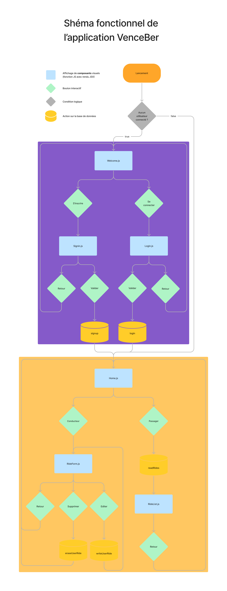

# VenceBer - Projet d'école
[Trophées NSI 2022](https://trophees-nsi.fr)

## Installation
- Le fichier étant plus volumineux que 20 mb, vous pouvez le trouver sur notre [dépôt GitHub](https://github.com/Deltavion/VenceBer/releases/tag/v0.3).
- Dans releases, téléchargez puis exécutez le fichier APK dans un environnement Android (natif ou émulé). 
- Si jamais il vous rencontrez des avertissements sur la source potentiellement dangereuse, ne vous inquiétez pas, nous n'avons pas pu mettre l'application sur le PlayStore et obtenir un certificat.

## Requis
- Il faut utiliser un environnement Android avec les services Google Play pour utiliser l'API Google MAPS.

## Utilisation
- Pour supprimer votre compte, il faut contacter l'ékip.
- Vous ne pouvez modifier votre mot de passe.

## Fonctionnement technique

## Technologies utilisées
L’application fonctionne sur le système d’exploitation Android.

Elle est développée avec React Native une librairie framework Javascript, sur l'environnement de développement Expo.
Les données sont stockées grâce à Firebase. Pour l'affichage de cartes nous utilisons l’API Maps SDK for Android.

## Dépendances Node.js
- @react-navigation/native: ^6.0.10
- @react-navigation/native-stack: ^6.6.2
- expo": "~44.0.0
- expo-location": "~14.0.1",
- expo-status-bar": "~1.2.0",
- firebase": "^9.7.0",
- react: 17.0.1
- react-dom: 17.0.1
- react-native: 0.64.3
- react-native-maps: 0.29.4
- react-native-safe-area-context: 3.3.2
- react-native-screens: ~3.10.1
- react-native-web: 0.17.1

## Liens
- Adresse mail : venceber.nsi@gmail.com
- Serveur discord : https://discord.gg/RuJPxVnsDG
